# Hard Surface Tools

A collection of hard surface modeling tools designed to aid in creating mesh based fillets on boolean objects.
Tools are implement in Python using the Blender Python and BMesh APIs.

Example fillets created using default tools vs the tools from this repository are shown below.

Default Tools Result       |  Custom Tools Result      |  Fillet Applied To Result
:-------------------------:|:-------------------------:|:-------------------------:
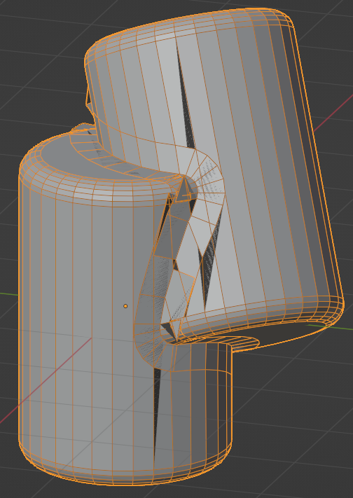  |  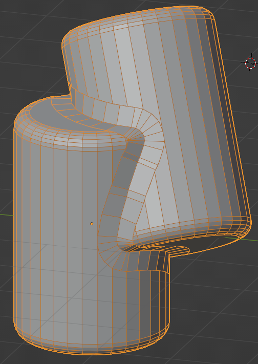 | 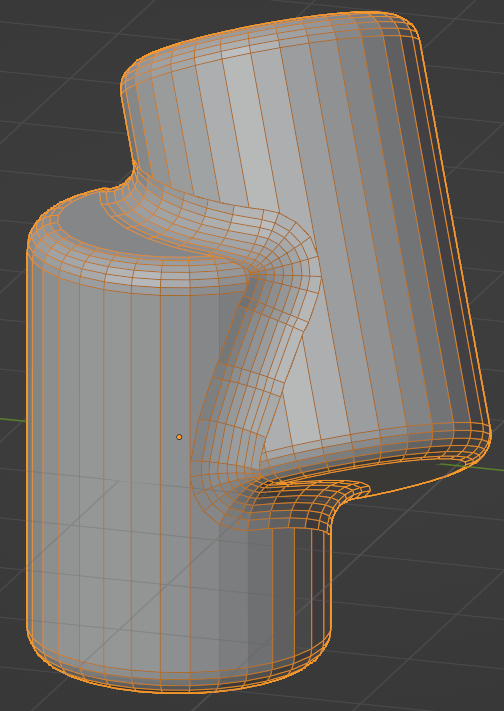
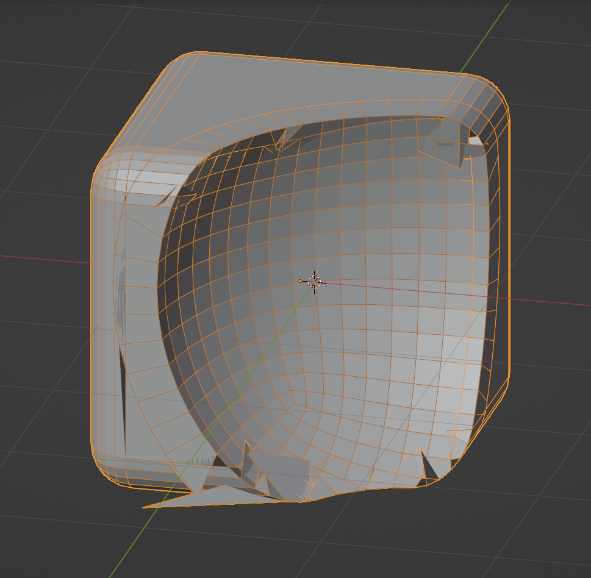  |  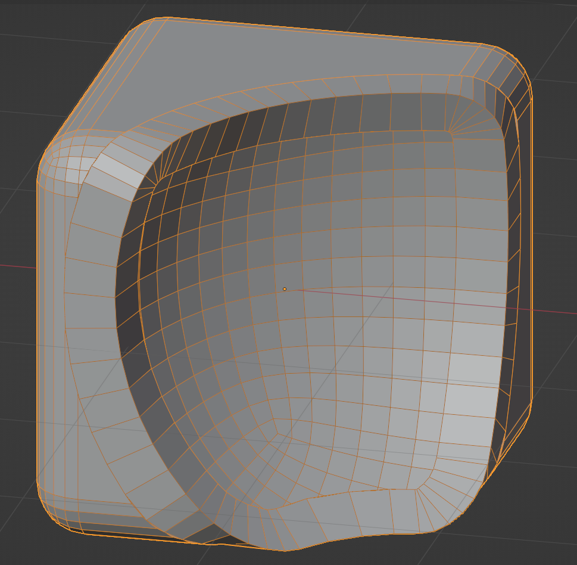 | 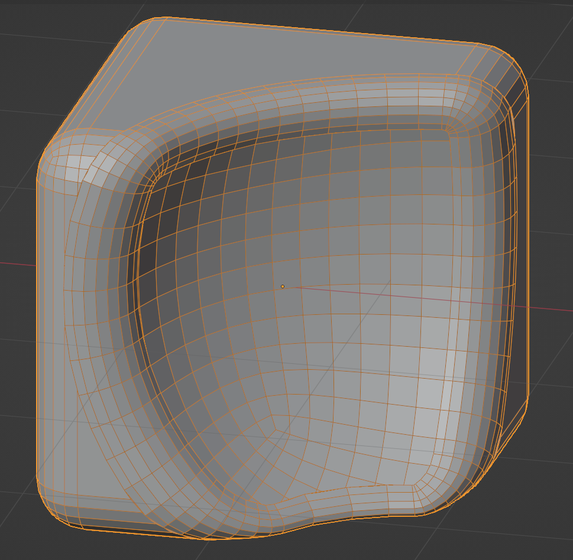
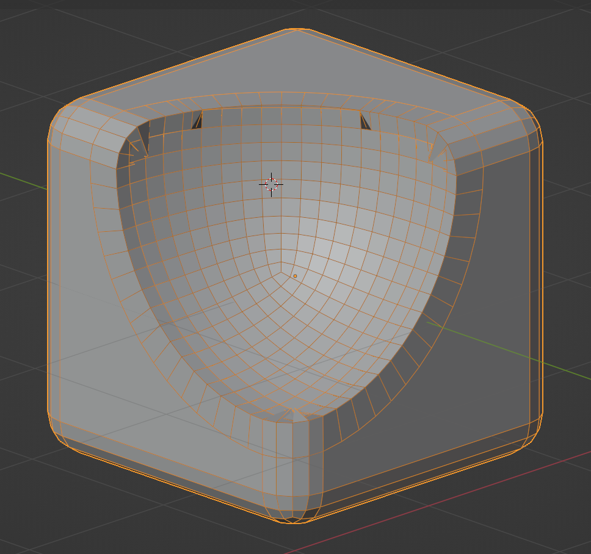  |  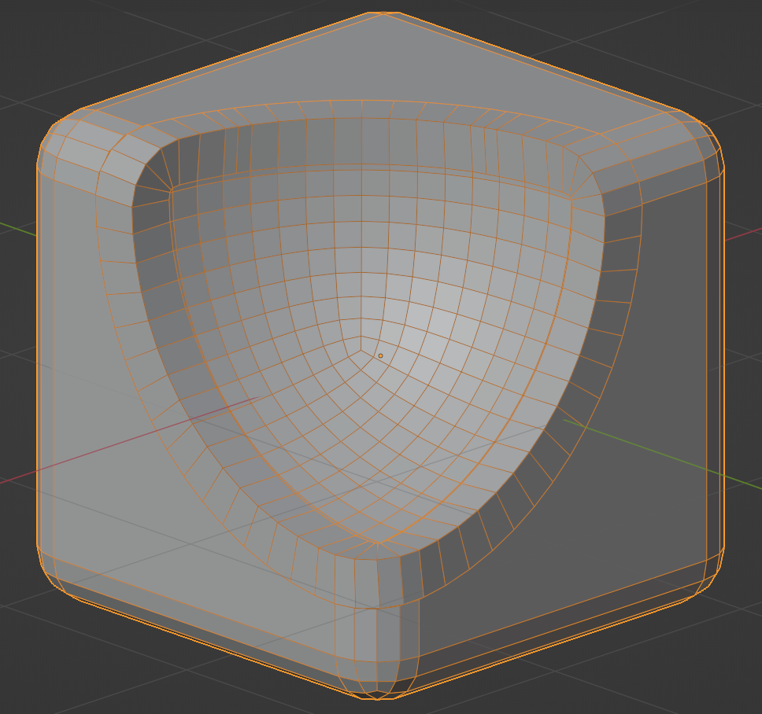 | 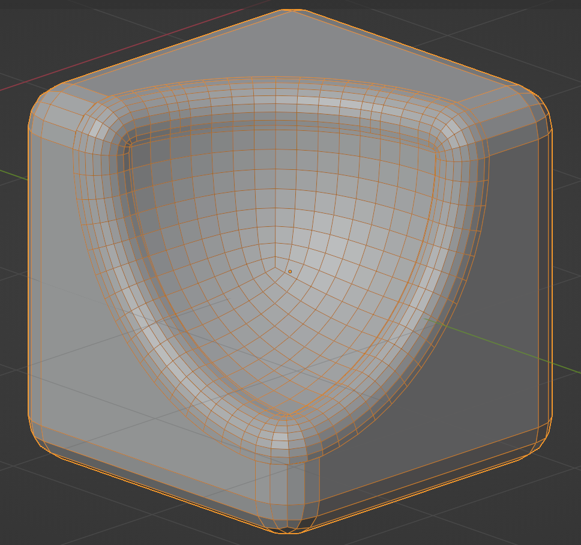
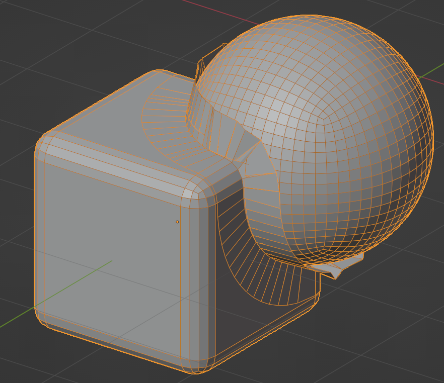  |  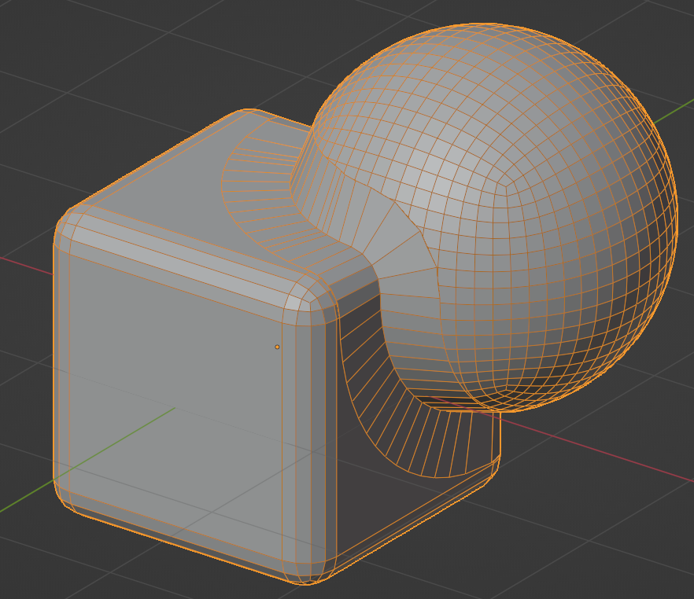 | 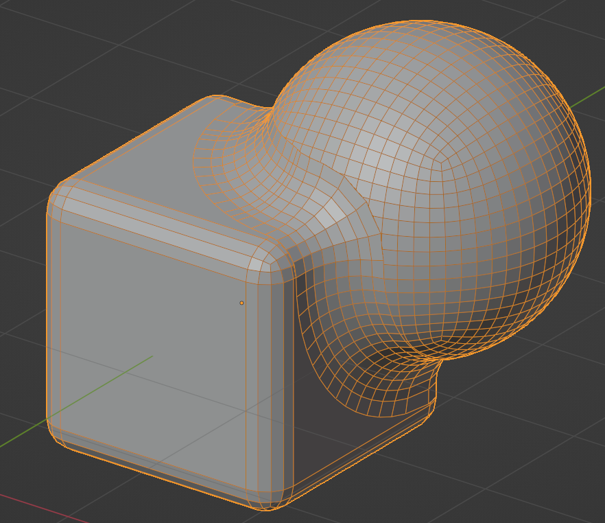

